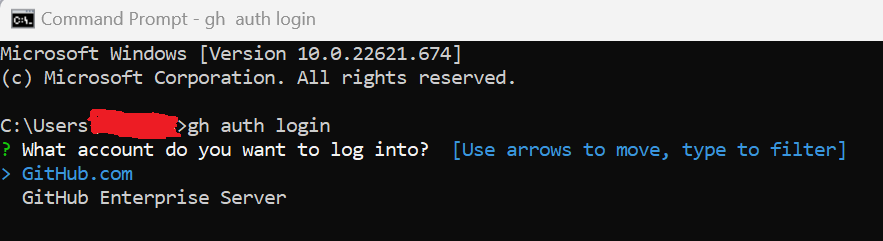
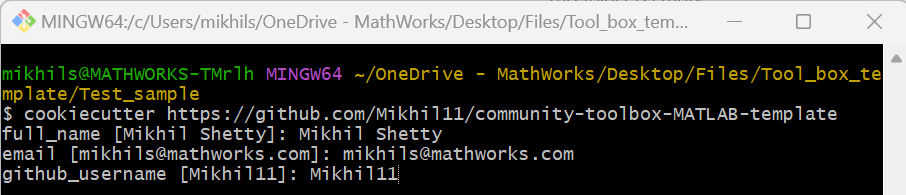
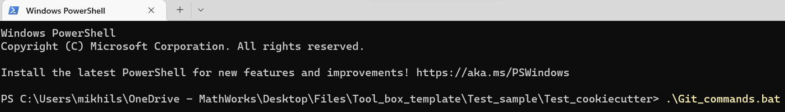
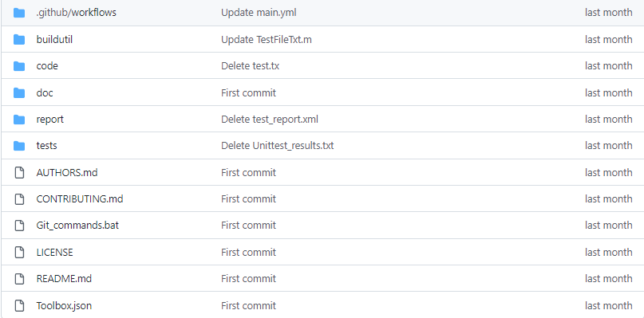

# MATLAB Support for Cookiecutter project templates

 

MATLAB Toolbox Template helps users generate their own MATLAB&reg; Toolboxes repository using a command line utility tool called [Cookiecutter][1]. The template folder structure and files which are generated as a part of this package is provided within the directory '{{cookiecutter.repo_name}}'

This project will follow [`README DRIVEN DEVELOPMENT`](https://tom.preston-werner.com/2010/08/23/readme-driven-development.html) process and it will be executed in the open using Github environment.

## Setup 

  

* Install [Python&trade;][8] Latest version 

* Install [Cookiecutter][9] using command: pip install cookiecutter 

* Install [Git Bash][6] in your system 

* Verify Git Bash installation using command line: 'git version' 

  

 

  

## Installation 

* Generate a MATLAB Toolbox local repository using the following command in Git Bash: 

    `cookiecutter https://github.com/Mikhil11/community-toolbox-MATLAB-template` 

* This will initiate an interactive setup in the Git Bash. Make sure the answer about github username and email matches with GitHub user's profile  details
 

* After creation of local repository, run the file Git_commands.bat using CMD. This will push the local repository to the user's GitHub profile. 
 

## Getting Started 

* The user should now be able to see a repository with all the template files as given below

 

* Add the core functionality files in the folder 'code' 

* This will trigger a series of GitHub workflows which will provide the users with ready to use MATLAB tools for generating various reports.

* The new repo is now ready to use. Clone the repository in the local folder 

* Generate mltbx file for your repository using the [ToolBox Package][5] 

* Import your plugin from within MATLAB using the [MATLAB add-on installation][4] 

* Tag a release for your Toolbox (`git tag`) 

 ## License 

<!--- Make sure you have a License.txt within your Repo ---> 

The license is available in the [LICENSE.md][3] file within this repository

 
## Community Support 

[MATLAB Central](https://www.mathworks.com/matlabcentral) 

Copyright 2022 The MathWorks, Inc. 

[1]: https://github.com/cookiecutter/cookiecutter 

[2]: https://github.com/mathworks/MATLAB-Support-for-Cookiecutter-Project-Templates/tree/main/%7B%7B%20cookiecutter.repo_name%20%7D%7D 

[3]: https://github.com/mathworks/MATLAB-Support-for-Cookiecutter-Project-Templates/-/blob/main/LICENSE 

[4]: https://in.mathworks.com/help/matlab/ref/matlab.addons.install.html 

[5]: https://in.mathworks.com/help/matlab/matlab_prog/create-and-share-custom-matlab-toolboxes.html 

[6]: https://git-scm.com/downloads 

[7]: https://cli.github.com/manual/gh_auth_login 

[8]: https://www.python.org/downloads/ 

[9]: https://pypi.org/project/cookiecutter/

[10]: https://cli.github.com/
