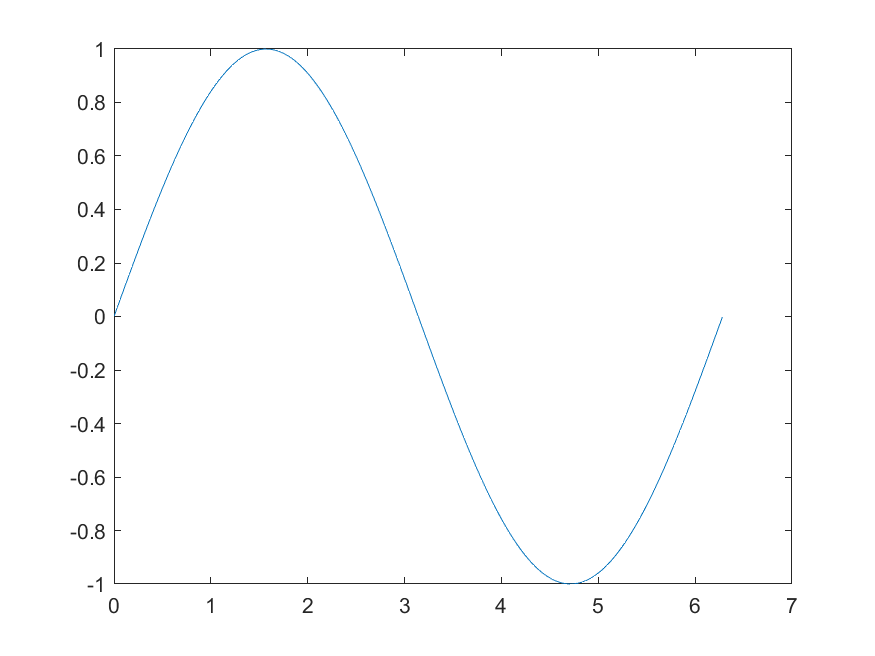

# {{ cookiecutter.RepositoryName }}  

[](https://www.mathworks.com/matlabcentral/fileexchange/####-file-exchange-title)   

<!-- Add this icon to the README if this repo also appears on File Exchange via the "Connect to GitHub" feature -->  

 
{{ cookiecutter.ProjectDescription }}

<!--- If your project includes a visualation or any images or an App please include a screenshot in this README ---> 
   

<!--- Markdown supports the following HTML entities: © - &copy;  ® - &reg;  ™ - &trade --->  
 

If your repository plans to accept contributions, you should include the `CONTRIBUTING.md` file in the repository. 

<!--- Please remember to delete all template related text that you are not using within your README.md --->
## Setup  

To Run: 

1. Step 1 

2. Step 2 

Additional information about set up  
 

### MathWorks Products (https://www.mathworks.com) 
 

Requires MATLAB release R#### or newer 

- [Product1](https://url-to-product1) 

- [Product1](https://url-to-product1)  
 

### 3rd Party Products: 

3p: 

- [Product1](https://url-to-product1) 

- [Product2](https://url-to-product2)  
 

## Installation (Optional) 

Installation instuctions 

Before proceeding, ensure that the below products are installed:   

* [Product1](https://url-to-product1)  

1. Step 1 

2. Step 2 


## Getting started with {{ cookiecutter.RootFolderName }} Toolbox

## How to use the toolbox functions:

```matlab:Code
%% Provide description about the toolbox function and provide an example for it
x = 2;
y = 3;
a =  addVariable(x,y);
disp(a)
b = subtractVariable(x,y);
disp(b)
```

## How to analyse and visualize the results (If any):

```matlab:Code
% Use MATLAB functions which user can  use to visualize data(if any)
x = 0:pi/100:2*pi;
y = sin(x);
plot(x,y)
```
![plot Image]

## License 

<!--- Make sure you have a License.txt within your Repo ---> 

The license for {{ cookiecutter.RepositoryName }} is available in the LICENSE.TXT file in this GitHub repository. 

or 
 

The license is available in the License file within this repository 

Include any other License information here, including third-party content using separate license agreements  
